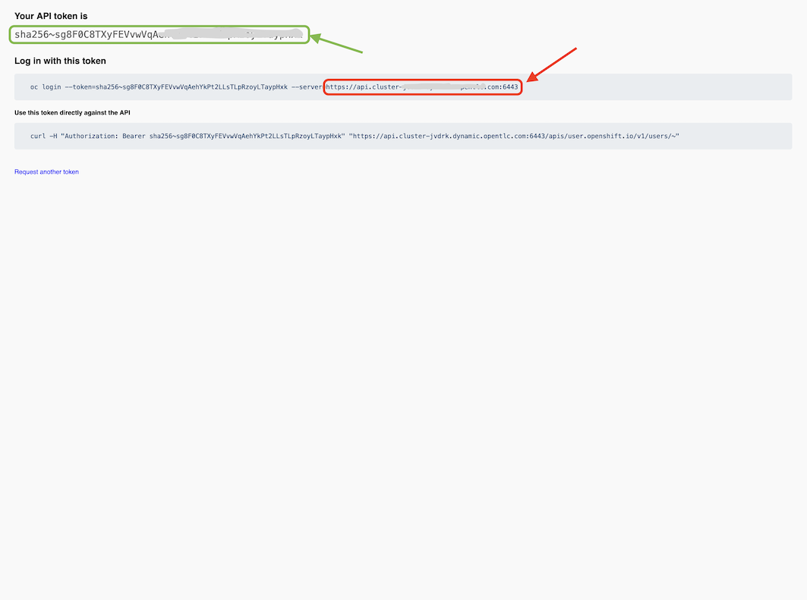
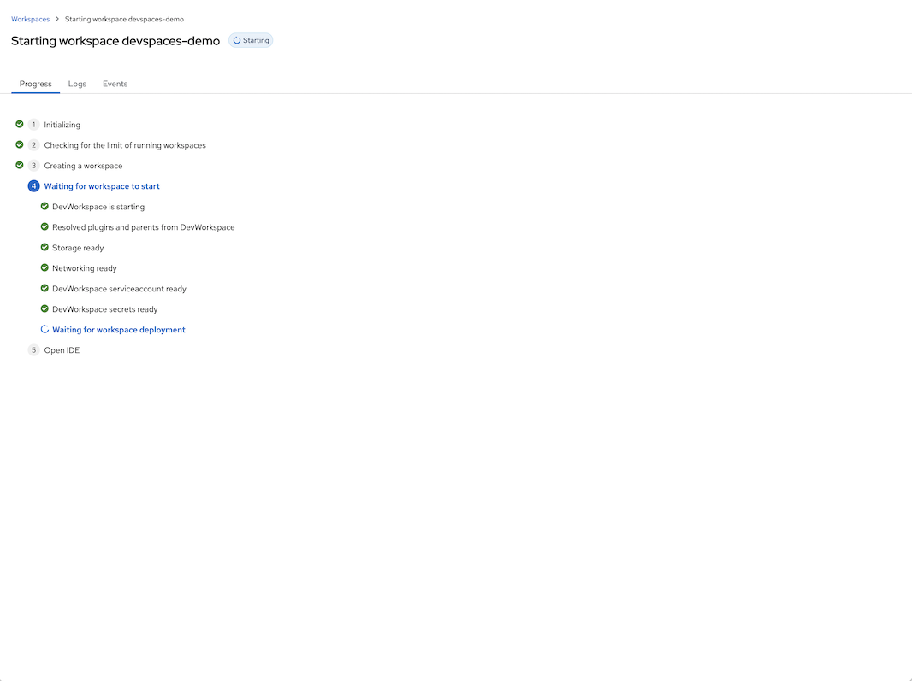
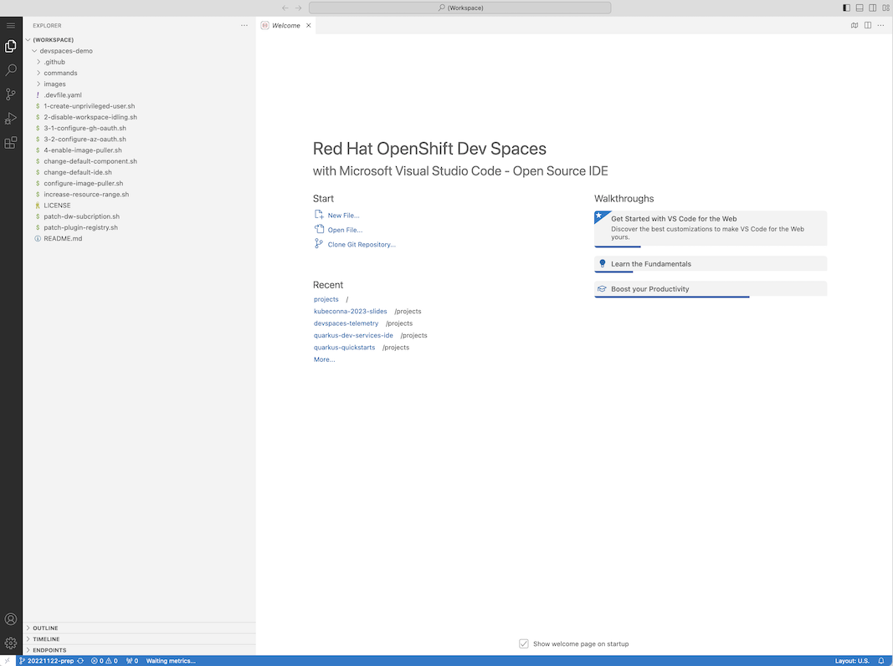
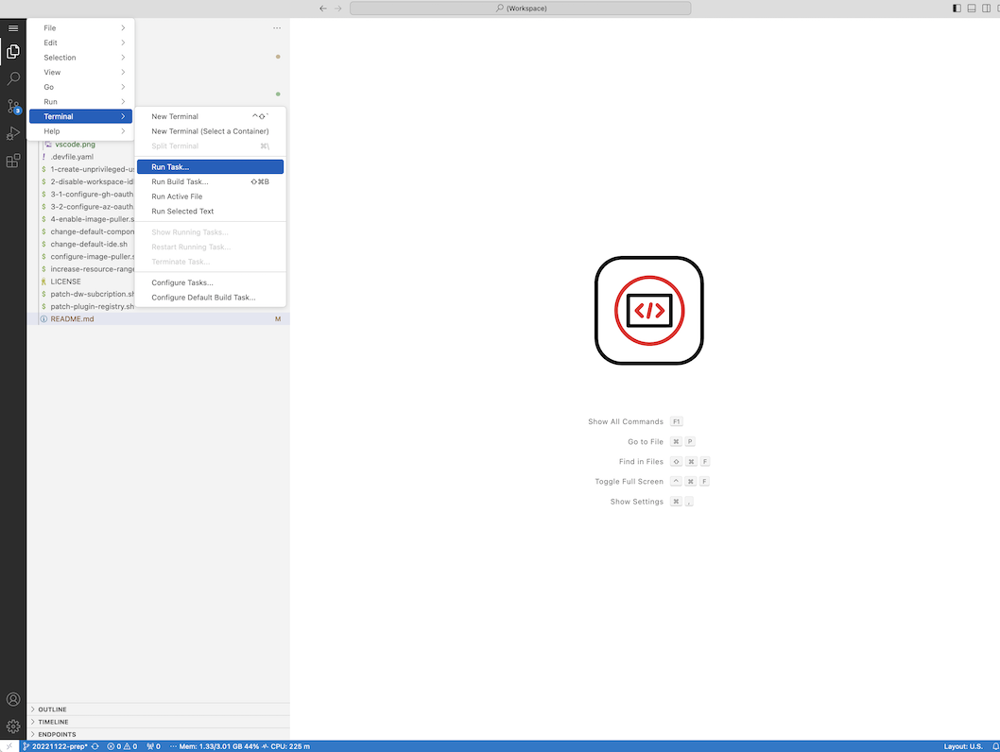
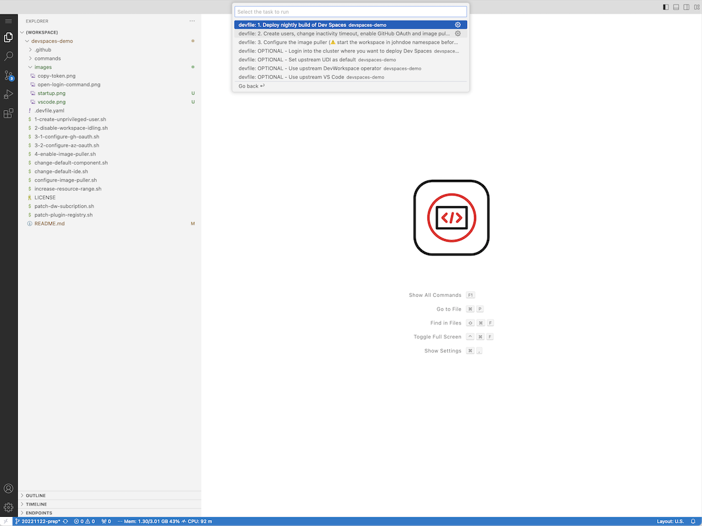
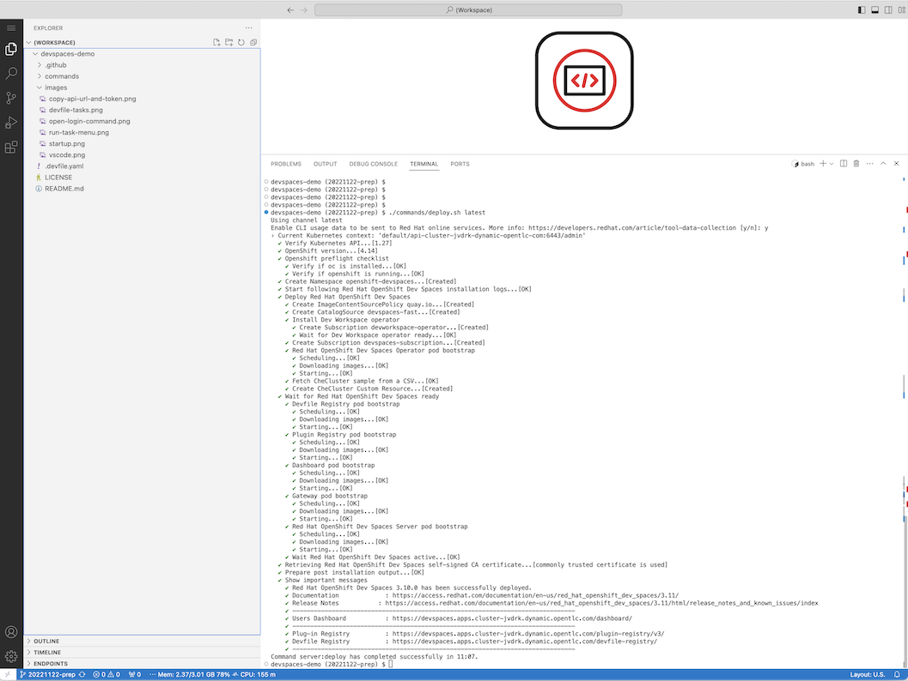

[](https://workspaces.openshift.com/#https://github.com/redhat-developer/devspaces-demo/tree/20231122-prep)

# OpenShift Dev Spaces Workshop

[Supporting slides](https://docs.google.com/presentation/d/1PUwPsY8TosHMsQT0iMe6zLD4wrd66U_oot2_oSIM9F0/edit?usp=sharing)

In this repository we provides the instructions to run an OpenShift Dev Spaces Workshop. It has 3 Admin tasks and 2 user tasks:

#### ADMIN TASKS:
1. **Preparation** - Instructions to setup an OpenShift cluster where we will install OpenShift Dev Spaces and to start a Cloud Development Environment that has some scripts to facilitate the deployment and configuration of OpenShift Dev Spaces.  
2. **Dev Spaces Deployment** - Steps to deploy the latest version of OpenShift Dev Spaces in the cluster setup before.
3. **Dev Spaces Configuration** - Day 2 tasks for an OpenShift Dev Spaces administrator.

#### USER TASKS:
1. **Customization of a Cloud Development Environment (CDE)** - How to customize the tools and the resources and of an OpenShift Dev Spaces CDE.  
2. **Managing CDEs using the DevWorkspace API** - How to programattically manage Dev Spaces cloud development environments.

## ADMIN TASK 1: Preparation

### 1. Provision an OpenShift cluster and copy the cluster API URL and token

The cluster should run OpenShift 4.10 or later. Make sure that Dev Spaces is not already installed in the cluster (the goal is to install it now). Once you have access to the cluster **as an admin**, copy the API URL and token:

| Select "Copy login command"   |  Copy OpenShift API URL and token 
:------------------------------:|:--------------------------------------:
 | 

### 2. Create a Developer Sandbox Account if you don't have one yet

Follow the instructions on [Red Hat Developer Sandbox web page](https://developers.redhat.com/developer-sandbox) to create an account. This will allow you to start a cloud development environment running this repository.

### 3. Open this git repository (devspaces-demo)

Click the badge  at the top of this page. After a few seconds you should see VS Code running in your browser with the source code of this repository.

| CDE Startup   |  CDE Running VS Code
:------------------------------:|:--------------------------------------:
 | 

The cloud development environment that you started runs has all the pre-requisties to run this demo. 

<!-- VS Code has some predefined "Devfile" tasks commands that can be used to run this demo steps.

|  Run Tasks Menu  |  Devfile Tasks
:------------------------------:|:--------------------------------------:
 |  -->


## ADMIN TASK 2: Dev Spaces Deployment

From Visual Studio Code running in your browser, open a terminal (`Terminal -> New Terminal`) and execute the following commands:
```bash
# Login to your OpenShift cluster. When prompted 
# provide the API URL and Token retrieved in the 
# preparation section
./commands/login.sh 

# Install OpenShift Dev Spaces CLI (`dsc`)
./commands/download-cli.sh

# Deploy OpenShift Dev Spaces
./commands/deploy.sh latest
```

Congratulations, you have just deployed OpenShift Dev Spaces. Follow the "Users Dashboard" link to log in to Dev Spaces.

|  `dsc server:deploy`  |  Users Dashboard
:------------------------------:|:--------------------------------------:
 | 

## ADMIN TASK 3: Dev Spaces Configuration

### 1. Configure [GitHub OAuth](https://access.redhat.com/documentation/en-us/red_hat_openshift_dev_spaces/3.9/html/administration_guide/configuring-devspaces#configuring-oauth-2-for-github) flow (or [Bitbucket](https://access.redhat.com/documentation/en-us/red_hat_openshift_dev_spaces/3.9/html/administration_guide/configuring-devspaces#configuring-oauth-2-for-a-bitbucket-server), [Gitlab](https://access.redhat.com/documentation/en-us/red_hat_openshift_dev_spaces/3.9/html/administration_guide/configuring-devspaces#configuring-oauth-2-for-gitlab), [AzureDevops](https://access.redhat.com/documentation/en-us/red_hat_openshift_dev_spaces/3.9/html/administration_guide/configuring-devspaces#configuring-oauth-2-for-microsoft-azure-devops-services))

With OAuth, Dev Spaces can automatically configure Cloud Development Environments of the developers with their git credentials. This capability is not enabled by default but has to be configured by an administrator. 

The following comand will guide you through the configuration of a GitHub OAuth application for Dev Spaces:

```bash
./commands/configure-gh-oauth.sh
```


### 2. Patch the [CheCluster Custom Resource](https://doc.crds.dev/github.com/eclipse-che/che-operator/org.eclipse.che/CheCluster/v2)

The Kubernetes Custom Resource Definition `CheCluster` is created by the Dev Spaces operator. Administrators should edit a `CheCluster` Custom Resource to configuration Dev Spaces.

The following scripts will patch the `CheCluster` custom resource named `devspaces` in the `openshift-devspaces` namespace.

```bash
# Disable inactive cloud development environment idling
./commands/disable-idling.sh
# Change the default development container to be upstream UDI
./commands/change-dev-container.sh quay.io/devfile/universal-developer-image
# Change the default IDE
./commands/change-default-ide.sh
# Use open-vsx.org rather than the embedded open-vsx registry
./commands/use-open-vsx.org.sh
```

NOTE: A lot more can be configured using the CheCluster custom resource. Try editing the CR with the OpenShift Console editor that has code completion.

### 3. Enable the [Kubernetes Image Puller](https://access.redhat.com/documentation/en-us/red_hat_openshift_dev_spaces/3.9/html/administration_guide/configuring-devspaces#caching-images-for-faster-workspace-start)

The Kuberentes Image Puller operator helps making the startup of Dev Spaces Cloud Development Environments faster. Run the following script to deploy this operator: 

```bash
./commands/enable-image-puller.sh
```

Run the following script to configure the [Kubernetes Image Puller](https://github.com/che-incubator/kubernetes-image-puller-operator) to pre-pull all the images of a specific OpenShift Dev Spaces workspace (the workspace should be running in the developer namespace):

```bash
./commands/configure-image-puller.sh
```

### 4. Configure the Getting Started samples in Users dashboard

[Link to the documentation article](https://access.redhat.com/documentation/en-us/red_hat_openshift_dev_spaces/3.9/html/administration_guide/configuring-devspaces#configuring-getting-started-samples)

### 5. Additional (optional) customizations

```bash
# Use nightly DevWorkspace operator build
./commands/additionals/patch-dw-subcription.sh
# Sometimes increasing the developer namespace resource
# quotas is required (especially to run IntelliJ)
./commands/additionals/increase-resource-range.sh
```

### 6. Airgap specific customization

OpenShift Dev Spaces is designed to run on restricted networks. The documentation article to install OpenShift Dev Spaces in such a network can be found [here](https://access.redhat.com/documentation/en-us/red_hat_openshift_dev_spaces/3.9/html/administration_guide/installing-devspaces#installing-devspaces-in-a-restricted-environment).

## USER TASK 1: Customization of a Cloud Development Environment (CDE)

Install the “Try in web IDE” browser extension [for Chrome](https://chrome.google.com/webstore/detail/try-in-dev-spaces/gbookaeilomckmoofeocnkfidfeendan), [Safari](https://apps.apple.com/us/app/try-in-dev-spaces/id6446597744) or [Firefox](https://addons.mozilla.org/en-US/firefox/addon/try-in-dev-spaces) and use it to open the following Git repository:

```
https://github.com/l0rd/rails-sample. 
```

This repository will help us to iteratively customize a Cloud Development Environment. Follow the instructions [in this blog post](https://che.eclipseprojects.io/2024/02/05/@mario.loriedo-cde-customization.html).

## USER TASK 2: Managing CDEs using DevWorkspaces

Cloud development environment can be [managed (created, updated and deleted) using the Kubernetes API](https://eclipse.dev/che/docs/stable/end-user-guide/managing-workspaces-with-apis/).

Follow the steps in [this Git repository README file](https://github.com/l0rd/devworkspace-demo).
